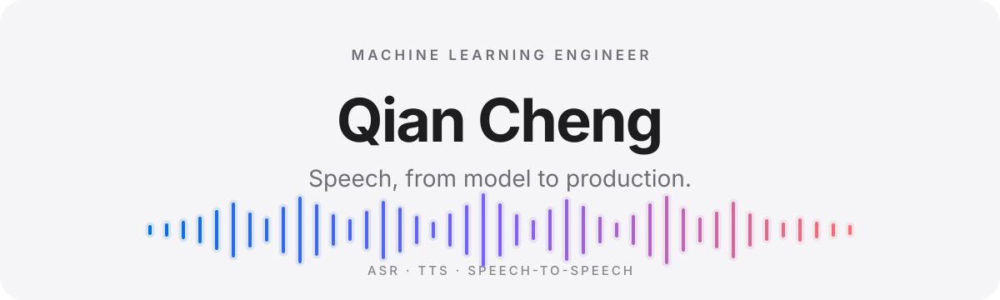

  <picture>
    <source media="(prefers-color-scheme: dark)" srcset="./assets/hero-dark.svg" />
    <source media="(prefers-color-scheme: light)" srcset="./assets/hero-light.svg" />
    
  </picture>

 

<h2 align="center">Speech systems, end to end.</h2>

  I build systems that understand, generate, and translate speech—from model training and evaluation 
  to GPU inference and production deployment.

 

### Understand.

Multilingual ASR, large-scale data pipelines, and reliable evaluation.

### Generate.

TTS and streaming speech-to-speech translation.

### Scale.

Distributed training, low-latency GPU inference, benchmarking, deployment, observability, and CI/CD.

 

## Selected work

**Production speech deployment.**  
ASR, TTS, and speech-to-speech services with immutable images, model hydration, scaling benchmarks, and automated releases.

**Mimi codec benchmarking.**  
Real-weight GPU performance and parity measurement across eager and CUDA Graph execution.

**Waki Demo Builder.**  
An agent/backend pipeline that turns meeting input into validated, sandboxed mini-app demos.

 

## Toolkit

<code>Python</code> · <code>PyTorch</code> · <code>Go</code> · <code>CUDA / GPU inference</code> · <code>Kubernetes</code> · <code>Docker</code> · <code>GitHub Actions</code>

 

---

  <strong>Apple</strong> · Siri TTS &nbsp;&nbsp;→&nbsp;&nbsp;
  <strong>Linktivity</strong> · Backend Systems &nbsp;&nbsp;→&nbsp;&nbsp;
  <strong>Kotoba Technologies</strong> · Speech AI

  M.S. in Electrical and Computer Engineering, Carnegie Mellon University 
  Tokyo, Japan

  <a href="mailto:chengqian1999@gmail.com"><strong>Get in touch ↗</strong></a>

